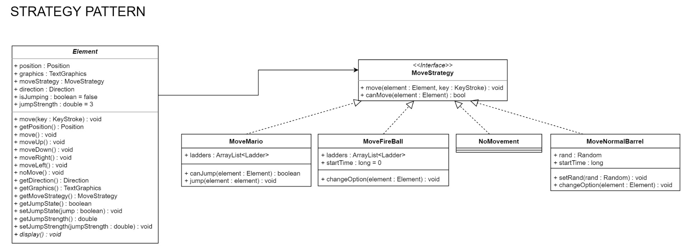
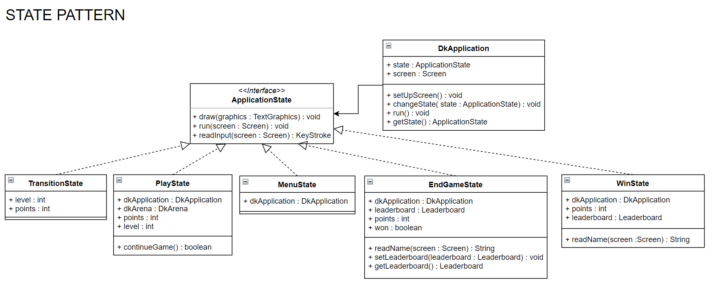
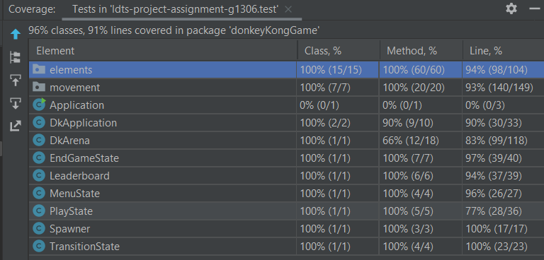
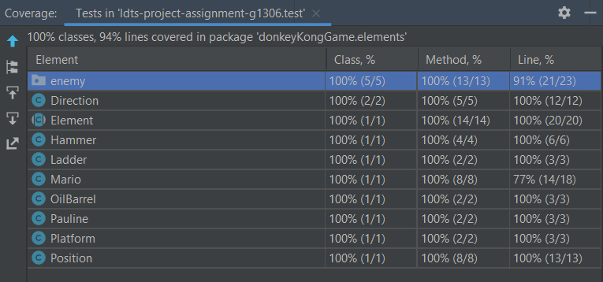
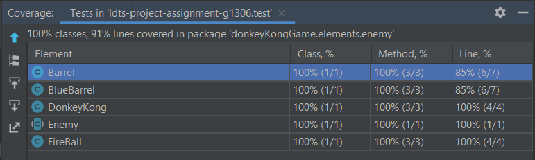
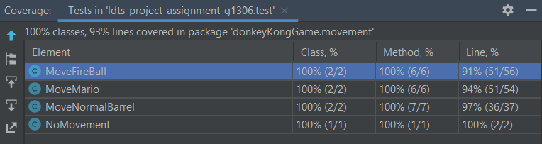
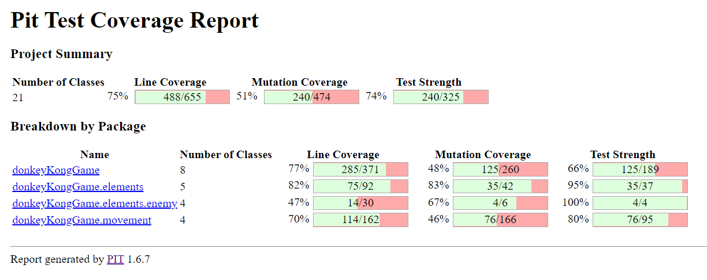
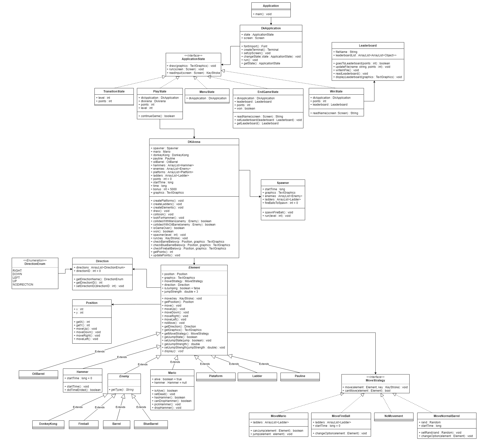

># LDTS_T11_G01 - Donkey Kong

## Game Description

A giant gorilla named Donkey Kong kidnapped Pauline. Marios' goal is to ascend across all platforms and rescue the princess.
Donkey Kong is going to try everything he can to stop Mario, such as throwing wood barrels and fireballs at him. These obstacles can kill the player, so, to dodge them, the player can jump over them or destroy them with the hammer.

## How to Play
- `Right Arrow` to go right
- `Left Arrow` to jump upwards
- `Up Arrow` to climb the ladders
- `Down Arrow` to down the stairs
- `Space` to Jump over objects

## Implemented Features

- **Buttons** - Functional and interactive buttons.
- **Keyboard control** - The keyboard inputs are received through the respective events and interpreted according to the current game state.
- **Player control** - The player may move with the keyboard control.
- **Jumping** - The player jump when space key is pressed.
- **Get Hammer** - The player can pick up a hammer which can destroy the barrels (The player also changes his colour when he has the hammer).
- **Damage** - When an enemy(any barrel or fireball) touches the player or vice versa, the player dies.
- **Barrels explosion** when the blue barrels reach the last platform and find the oil barrel, they explode and transform into fireballs
- **Score** - While playing, the player will get points for jumping over barrels and destroying them, they also gain points when they reach a new level and have a bonus that starts at 5000 and decreases with time.
- **LeaderBoard** - Whe the player scores sufficient points to make top 5, he is asked to insert his name in order to save it in the LeaderBoard.
- **Levels** - The game has 3 levels, each level the frequency that the barrels spawn increases by 0.6s to make it more difficult to reach the top.
- **Random Movement** - Both barrels and Fireballs have a random movement. The barrels move down the platforms until they find the oil barrel, but they randomly choose whether they want to use the ladder or not.
   The Fireballs choose where they want to go, they always move in a certain direction until they find a new path or until the platform is over. When a new path is found, they choose randomly want they want to do.

## PLANNED FEATURES

- All the planed features were implemented successfully.

## DESIGN

### Problem in Context:
While creating the game we noticed that different objects would have the same parameters but their behavior would be different (For example there are two types of barrels
,the ones that roll through the platforms and the ones that fall all the way down to the last platform).

#### The Pattern:
The pattern used to solve this problem was the **Strategy Pattern**, a behavioral pattern that let us have different objects that extends from the same class but have different behaviors.  

  

  <b><i>Fig 1. Strategy pattern design</i></b>

#### Implementation:

The strategy allows us to create an abstract class that represents pretty much all the game elements. The [Element](../src/main/java/DonkeyKongGame.Elements/Element.java) class is the abstract class for all game objects, it has a position and a moving strategy but 
different elements can have different behaviors. For example, we have the main character [Mario](../src/main/java/DonkeyKongGame.Elements/Mario.java) and we have an obstacle called [Barrel](../src/main/java/DonkeyKongGame.Elements/Enemy/Barrel.java), both have a position and a moving strategy but the movement of the [Barrel](../src/main/java/DonkeyKongGame.Elements/Enemy/Barrel.java)
is completely different from [Mario's](../src/main/java/DonkeyKongGame.Elements/Mario.java) movement, so we created an interface called [MoveStrategy](../src/main/java/DonkeyKongGame.Movement/MoveStrategy.java) that has different moving strategies, such as [MoveMario](../src/main/java/DonkeyKongGame.Movement/MoveMario.java), [MoveNormalBarrel](../src/main/java/DonkeyKongGame.Movement/MoveNormalBarrel.java) and so on.

#### Consequences:

Using this pattern our code gets cleaner and more organized. We can easily change a specific element without having to change the hole code.

### Problem in Context:
Our game has several menus that can be displayed and while creating them we noticed that the classes started to seem a little confusing. 

#### The Pattern:
The pattern used to solve this problem was the **State Pattern**, a behavioral patter that lets us alter an object behaviour.

  

  <b><i>Fig 2. State pattern design</i></b>

#### Implementation
The State Pattern allows us to create several classes that implement an interface representing all the possible states.
Basically we have a [DkApplication](../src/main/java/DonkeyKongGame/DkApplication.java) that has an [ApplicationState](../src/main/java/DonkeyKongGame/ApplicationState.java) 
and when we want to change the menu we change it's state to a new one and the next time the application runs the state it will run
the new state changed by the user.

#### Consequences:

Using the state patter we could create new states without changing other classes, and it made easier to read and to understand what
states the game has and how they change from one to another.

## Tests

We used both Junit and spock to test our code.

We also used mocks when we didn't want to test a certain class but we needed it in order to complete the test.

All tests pass successfully. 

### Line Coverage:
We managed to cover 96% of our classes and 91% of our lines.

  

  <b><i>Fig 3. Coverage</i></b>

  

  <b><i>Fig 4. Element Coverage</i></b>

  

  <b><i>Fig 5. Enemy Coverage</i></b>

  

  <b><i>Fig 6. Movement Coverage</i></b>

### Line Coverage using Pitest:

  

  <b><i>Fig 7. Pitest Mutation Coverage</i></b>

Note: 
- The spock tests didn't really work with pitest so the coverage
we see only comes from the junit tests.

### Link to mutation testing report

[Pitest Report](../docs/reports/pitest/index.html)

## UML DIAGRAM

  

  <b><i>Fig 8. UML</i></b>

## CODE SMELLS AND REFACTORING

#### Bloaters - Large Method

- The constructor of [DkArena](../src/main/java/donkeyKongGame/DkArena.java) was way too large. 
To solve that we refactored the method using the **extract method** three times and created three methods
createElements, createWalls and createLadders that work as their name says.

#### Dispensables - Lazy Class

- [Direction](../src/main/java/donkeyKongGame/elements/Direction.java) is only composed of getters and setters therefore
it's recognized as a lazy class. We could refactor this code smell by using the **inline method**, but this class is still necessary and
offers some organization of the code in general, so we didn't think any changes were needed.

#### Object-Orientation Abusers - Refused Bequest

- [OilBarrel](../src/main/java/donkeyKongGame/elements/OilBarrel.java), [Hammer](../src/main/java/donkeyKongGame/elements/Hammer.java),
[Platform](../src/main/java/donkeyKongGame/elements/Platform.java), [Ladder](../src/main/java/donkeyKongGame/elements/Ladder.java), 
[Pauline](../src/main/java/donkeyKongGame/elements/Pauline.java) and [DonkeyKong](../src/main/java/donkeyKongGame/elements/DonkeyKong.java)
don't take much use of the methods from [Element](../src/main/java/donkeyKongGame/elements/Element.java) since they don't really move
implying a refused bequest code smell. To resolve this we could refactor by using the 
**extract superclass** method, however, this implementation just makes sense for the
purpose of the Strategy Pattern design.

#### More refactoring

- Writing simpler units of code
- Writing shorter units of code
- Fixing test bugs
- Fixing implementations

## Self-evaluation

All the member os the group contributed with their best to develop the project. It helped us grow both as
programmers and team workers.

| Name                 |     Contribution     |
| -------------------- | -------------------- | 
| Diogo Neves          |         33.3%        |
| Matilde Sequeira     |         33.3%        |
| Tomás Carmo          |         33.3%        |

